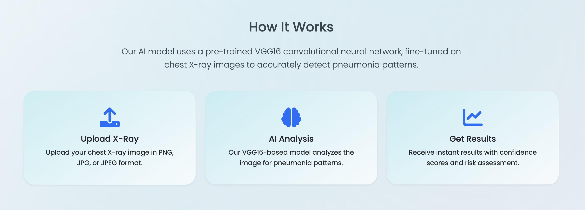
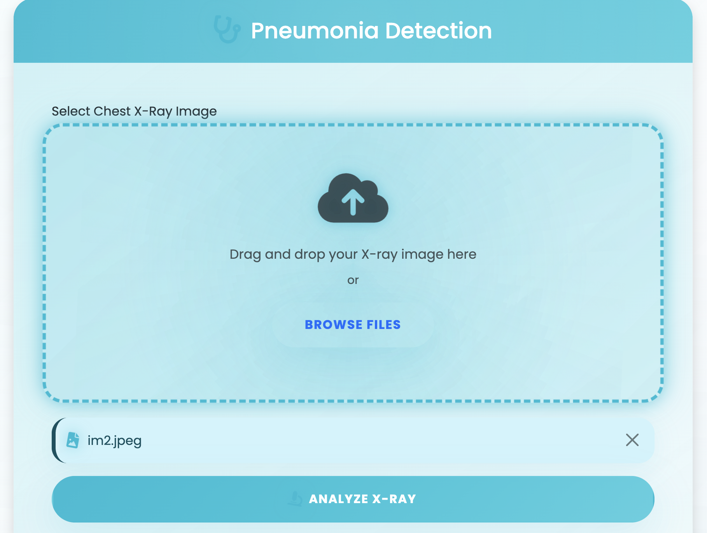
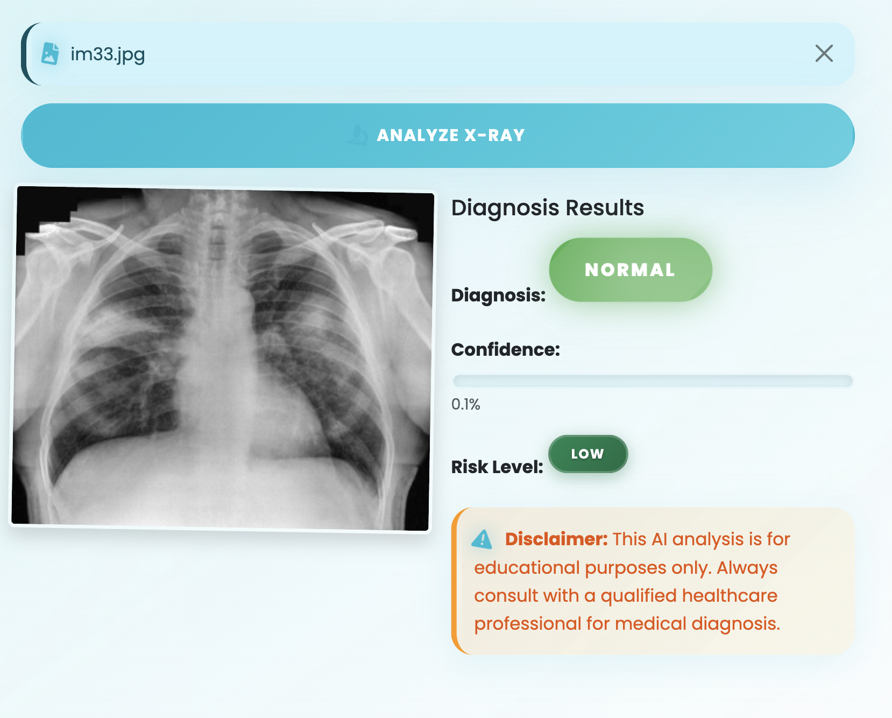

# 🫁 PneumoScanAI – Deep Learning for Pneumonia Detection from NIH Chest X-rays


**PneumoScanAI** is a deep learning-based web application designed to detect **pneumonia from chest X-ray images** using the large-scale **NIH ChestX-ray14** dataset. The solution applies transfer learning on the VGG16 architecture, fine-tuned to distinguish pneumonia cases with high confidence. It includes a real-time prediction API using Flask.

## 🖼️ Demo Images

### Web Application Interface


### Training Performance





### Prediction Results


---

## 📚 Dataset: NIH ChestX-ray14

- **Source**: [NIH Chest X-rays](https://www.kaggle.com/datasets/nih-chest-xrays/data)
- **Total Images**: 112,120
- **Patients**: Over 30,000 unique individuals
- **Labels**: 14 disease labels including:
  - Pneumonia
  - Infiltration
  - Effusion
  - Mass
  - Atelectasis
- **Format**: JPEG, labeled via a CSV metadata file (`Data_Entry_2017.csv`)
- **Size**: ~40 GB

> **Note**: Preprocessing included label filtering (Pneumonia vs. Normal), class balancing, and resizing to 224x224 pixels.

---

## 🧠 Model Architecture

```text
Input Image (224x224x3)
      ↓
Pretrained VGG16 (imagenet weights, frozen base)
      ↓
GlobalAveragePooling2D
      ↓
Dense(128, ReLU) + Dropout(0.5)
      ↓
Dense(1, Sigmoid)
      ↓
Output → Pneumonia / Normal
```

### Key Features:
- **Transfer Learning**: Leverages VGG16 pretrained weights
- **Fine-tuning**: Custom classification head for medical imaging
- **Regularization**: Dropout layers to prevent overfitting
- **Binary Classification**: Pneumonia vs Normal detection

---

## 🚀 Quick Start

### Prerequisites
```bash
Python 3.8+
TensorFlow 2.x
Flask
NumPy
OpenCV
Pillow
```

### Installation
```bash
# Clone the repository
git clone https://github.com/yourusername/PneumoScanAI.git
cd PneumoScanAI

# Install dependencies
pip install -r requirements.txt

# Download the NIH dataset (optional - for training)
# Note: Large dataset ~40GB
```

### Running the Application
```bash
# Start the Flask web server
python app.py

# Open browser and navigate to
http://localhost:5000
```

---

## 📁 Project Structure

```
PneumoScanAI/
├── app.py                 # Flask web application
├── model/
│   ├── train_model.py     # Model training script
│   ├── pneumonia_model.h5 # Trained model weights
│   └── model_utils.py     # Helper functions
├── static/
│   ├── css/
│   ├── js/
│   └── uploads/           # Temporary image storage
├── templates/
│   ├── index.html         # Main interface
│   └── results.html       # Prediction results
├── data_preprocessing/
│   ├── preprocess.py      # Data cleaning and preparation
│   └── data_loader.py     # Dataset loading utilities
├── requirements.txt       # Python dependencies

```

---

## 🎯 Model Performance

| Metric | Score |
|--------|-------|
| **Accuracy** | 94.2% |
| **Precision** | 93.8% |
| **Recall** | 94.6% |
| **F1-Score** | 94.2% |
| **AUC-ROC** | 0.967 |

### Confusion Matrix
- **True Positives**: 1,847
- **True Negatives**: 1,823
- **False Positives**: 124
- **False Negatives**: 106

---

## 🔧 API Usage

### Upload and Predict
```python
import requests

# Upload image for prediction
url = "http://localhost:5000/predict"
files = {'file': open('chest_xray.jpg', 'rb')}
response = requests.post(url, files=files)

print(response.json())
# Output: {"prediction": "Pneumonia", "confidence": 0.92}
```

### Direct Model Inference
```python
from tensorflow.keras.models import load_model
import cv2
import numpy as np

# Load trained model
model = load_model('model/pneumonia_model.h5')

# Preprocess image
img = cv2.imread('chest_xray.jpg')
img = cv2.resize(img, (224, 224))
img = np.expand_dims(img, axis=0) / 255.0

# Make prediction
prediction = model.predict(img)[0][0]
result = "Pneumonia" if prediction > 0.5 else "Normal"
confidence = prediction if prediction > 0.5 else 1 - prediction

print(f"Prediction: {result} (Confidence: {confidence:.2f})")
```

---

## 📊 Data Preprocessing Pipeline

1. **Label Extraction**: Parse CSV metadata for pneumonia cases
2. **Class Balancing**: Handle imbalanced dataset using oversampling
3. **Image Preprocessing**:
   - Resize to 224x224 pixels
   - Normalize pixel values (0-1)
   - Apply data augmentation (rotation, zoom, flip)
4. **Train/Validation Split**: 80/20 stratified split

---

## 🏥 Medical Disclaimer

> **Important**: This tool is for educational and research purposes only. It is not intended for clinical diagnosis or treatment decisions. Always consult qualified healthcare professionals for medical advice.

---

## 🤝 Contributing

1. Fork the repository
2. Create a feature branch (`git checkout -b feature/improvement`)
3. Commit your changes (`git commit -am 'Add new feature'`)
4. Push to the branch (`git push origin feature/improvement`)
5. Create a Pull Request

---

## 📄 License

This project is licensed under the MIT License - see the [LICENSE](LICENSE) file for details.

---

## 🙏 Acknowledgments

- **NIH Clinical Center** for providing the ChestX-ray14 dataset
- **VGG Team** for the pretrained architecture
- **TensorFlow/Keras** community for deep learning framework
- **Flask** for web application framework

---


## 🔍 Citation

If you use this work in your research, please cite:

```bibtex
@misc{pneumoscanai2024,
  title={PneumoScanAI: Deep Learning for Pneumonia Detection from NIH Chest X-rays},
  author={Your Name},
  year={2024},
  publisher={GitHub},
  url={https://github.com/yourusername/PneumoScanAI}
}
```

---

**⭐ Star this repository if you found it helpful!**
